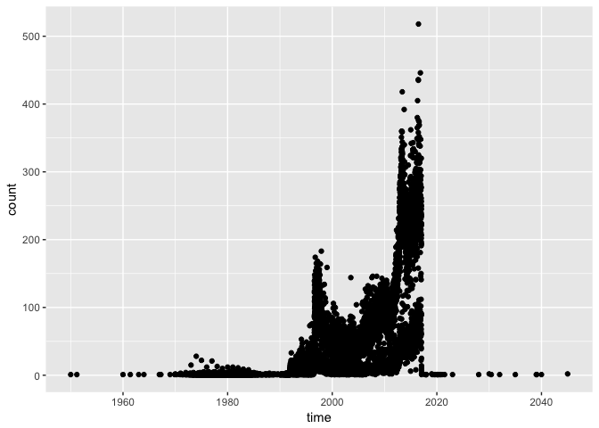
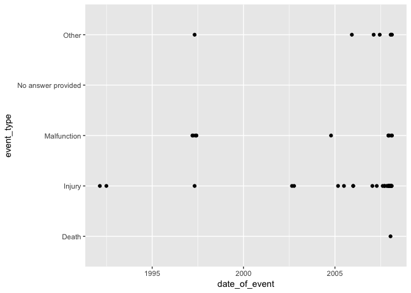

The package is a convinence tools for accessing openFDA API <https://open.fda.gov>. The package enables users to query the Device Adverse Events, Device Classification, Device 510(k) Clearances, Device PMA, Device Registrations and Listings, Device Recalls, Device Recall Enforcement, and Unique Device Identifier databases. For example, a user can query information about recall events about the specific device. More information about the openFDA API is located at <https://open.fda.gov/api/reference/>. Right now, this package is limited in scope to the medical devices category. Drug and food are not supported yet.

Packet Setup
------------

``` r
library(ropenfda)
```

Count Data
----------

Data can be fetched from the openFDA API using `openfda` method. The resulting object is an S4 class specific to the data that was retrieved.

``` r
res <- openfda(query = "", count_var = "date_facility_aware")
head(res, 3)
#> # A tibble: 3 × 2
#>         time count
#>       <date> <int>
#> 1 1950-01-01     1
#> 2 1951-03-06     1
#> 3 1960-01-01     1
class(res)
#> [1] "CountDeviceEvent"
#> attr(,"package")
#> [1] "ropenfda"
```

Parameter `query`, which in this example is an empty string, is getting all available data from the default category `device` and default database `event`. The parameter `count_var` specifies a field which unique values are counted and provided as a result. Dates are automatically converted into the `Date` objects. The class of this object is `CountDeviceEvent` class.

A quick look into the count data can be done with `plot` method. We will quickly notice that there are few points with wrong dates beyond year 2017!

``` r
plot(res)
```



Raw Data
--------

In order to access original, not aggregated data, we simply omit the `count_var` parameter. For raw data openFDA API returns up to 5100 rows. If we do not specify the `limit` parameter, the default value is 5100.

``` r
res <- openfda(query = "", limit = 100)
#> Warning: Only 100 records retrieved from the total of 5996510
res[1:4, c(3,4,10,13)]
#> # A tibble: 4 × 4
#>   event_location report_to_fda         event_type      report_number
#>            <chr>         <chr>              <chr>              <chr>
#> 1       HOSPITAL             Y             Injury                 10
#> 2          OTHER             Y             Injury 2243621-1992-00036
#> 3   INVALID DATA             N No answer provided              10000
#> 4       HOSPITAL             N             Injury             100000
```

Similarly, quick look into data can ba done with the `plot` method:

``` r
plot(res, i = "date_of_event", j = "event_type")
```



For more details see vignette summary.Rmd
